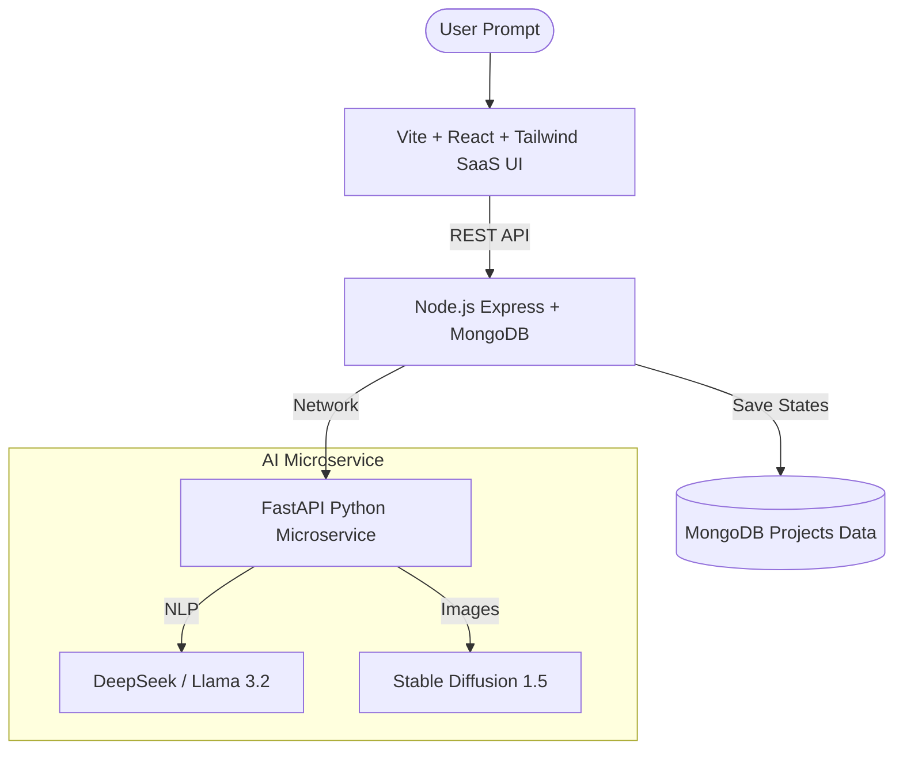

<div align="center">
  
  <h1>StateCraft AI</h1>
  <p><b>Autonomous UI Workflow Agent & State Machine Generator</b></p>
</div>

<br/>

StateCraft AI is a complete three-tier SaaS platform that allows developers to write plain natural language describing how their UI should behave, and lets an autonomous AI Agent generate the underlying formal logic, interactive state diagrams, raw production code, and even conceptual visual wireframes.

---

## ⚡ Features

*   **🧠 DeepSeek Structural Intelligence**: Uses advanced open-source LLMs (DeepSeek R1/Llama) acting as reasoning agents to read complex natural language logic (e.g. *"When success occurs in loading, move to dashboard"*) and compile it to a strict UI State Machine AST.
*   **🎨 AI Visual Wireframes**: Integrates with Stable Diffusion 1.5 to instantly generate a Dribble-style conceptual thumbnail representing the described UI.
*   **🕸️ Interactive Flow Nodes (Shapes & Vectors)**: Custom SVG rendering math produces beautiful, gravity-controlled force-directed node layouts entirely offline.
*   **⚙️ 6 Multi-Platform Code Generators**: Export immediately out to **XState v5**, **React Reducers**, **Zustand**, pure **TypeScript enum switches**, Mermaid Diagrams, and JSON.
*   **📊 Live Simulator Walkthroughs**: A localized client-side sandbox allowing testers to click events and virtually "walk through" the logic tree before it touches any application logic.
*   **🛡️ Legacy Safe-Core Execution**: Our pristine javascript gravity engine runs seamlessly isolated via React hooks, providing zero-dependency node crunching securely in the frontend.

---

## 🏛️ Architecture & Tech Stack

StateCraft AI has been thoroughly refactored into a modern MERN + Python Microservice Architecture.



### Stack Details
*   **Frontend**: React.js 18, Vite, Tailwind CSS, Lucide Icons, Legacy Canvas Engine.
*   **API Gateway**: Node.js, Express, Mongoose.
*   **AI Service**: Python, FastAPI, python-dotenv, HuggingFace Serverless Endpoints.

---

## 🚀 Getting Started (Run the Beast)

To run the full stack locally, you need three separate terminal windows to boot the independent microservices.

### 1. Setup Python AI Agent Service
*Provides natural language comprehension boundaries and image generation endpoints.*
```bash
cd ai-service
python -m venv venv
# On Windows: .\venv\Scripts\activate
# On Mac/Linux: source venv/bin/activate
pip install fastapi uvicorn python-dotenv requests pydantic

# Create your .env file with Hugging Face Token: HF_TOKEN=...
uvicorn main:app --reload
```
*Service boots at `http://127.0.0.1:8000`*

### 2. Setup Node.js API Gateway & Database
*Manages the MongoDB Atlas data routing, saving projects, and routing LLM calls securely.*
```bash
cd backend
npm install
# Make sure you have MongoDB running locally at mongodb://localhost:27017
node server.js
```
*Service boots at `http://localhost:5000`*

### 3. Setup React SaaS Frontend
*The high-performance glassmorphism client application.*
```bash
cd frontend
npm install
npm run dev
```
*Application boots at `http://localhost:5173`*

---

## 🎨 Visuals & Shapes 

Unlike rigid grid layouts, StateCraft uses a mathematically driven **Force-Directed Graph (Gravity Simulation)** drawing circles (`<circle>`), flowing arrows (`<path>`), and SVG `marker` tags dynamically.
*   🟢 **Green Orbs**: Identify valid Starting Points in your application logic.
*   🔴 **Red Orbs**: Represent known Error Boundaries.
*   🔵 **Blue Orbs**: Represent terminal states (Final checkouts/success screens).
*   ⚡ **Glowing Edges**: In the Sandbox simulator, the current active node emits a glassmorphic blue neon glow using `box-shadow` CSS animations.

---

### Project Philosophy
Built to completely abstract away the brutal task of hand-writing application edge-cases, allowing humans to speak plainly, and machines to write machine code.
